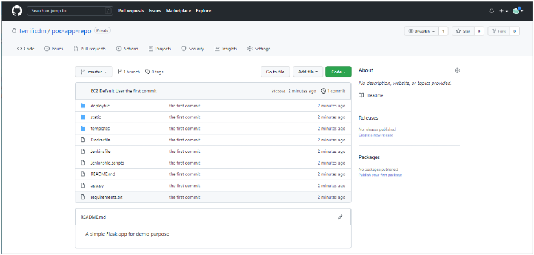
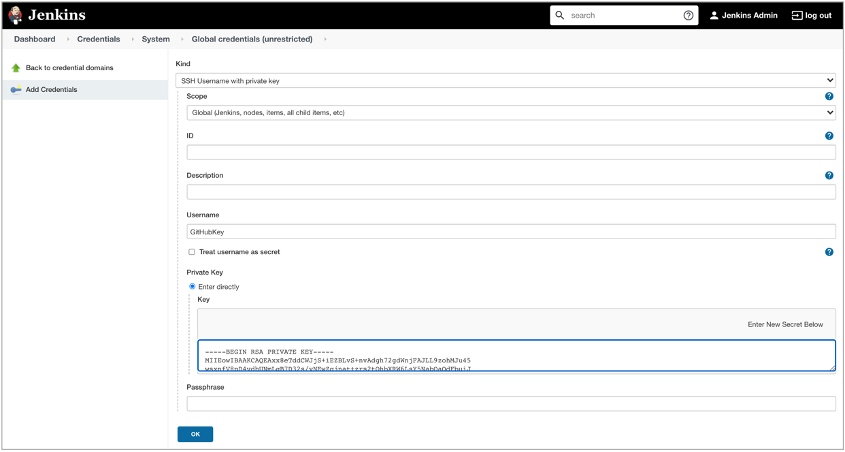

> A simple Flask app for demostrating GitHub+Jenkins+Amazon EKS CI/CD Pipeline.
## 在 Amazon EKS 上使用 GitHub+Jenkins 构建CI/CD流水线

### 前提条件：
安装好Amazon EKS（如版本：1.21），安装好Amazon EKS所需的AWS LoadBalancer Controller 插件
### 构建步骤：
#### 1.	Helm 客户端安装
命令行执行:  

```bash
curl https://raw.githubusercontent.com/helm/helm/master/scripts/get-helm-3 > get_helm.sh
chmod 700 get_helm.sh
./get_helm.sh
helm version
```
#### 2.	通过 Helm 安装 Jenkins
命令行执行:  

```bash
helm repo add jenkins https://charts.jenkins.io
helm repo update
helm search repo jenkins
helm pull jenkins/jenkins
tar -zvxf jenkins-3.8.8.tgz
cd jenkins
vim values.yaml
```
> Jenkins-3.8.8.tgz 为当前下载的Jenkins Helm Chart版本

设置yaml文件:  
取消 "adminPassword" 注释，添加自定义的Jenkins登陆密码；设置 "servicePort" 为80端口；设置"ingress->enabled" 为true，设置 "ingress->apiVersion" 为"networking.k8s.io/v1"，"ingress->annotations"下添加如下内容：

```bash
annotations: 
  kubernetes.io/ingress.class: alb
  alb.ingress.kubernetes.io/scheme: internet-facing
  alb.ingress.kubernetes.io/target-type: ip
```
为Jenkins创建namespace，并安装Jenkins

```bash
kubectl create ns jenkins-cicd
helm install jenkins -f values.yaml jenkins/jenkins -n jenkins-cicd
kubectl get all -n jenkins-cicd
```
获取Jenkins登陆URL，并使用admin/<password> 登陆

```bash
kubectl get ingress -n jenkins-cicd
```


  
#### 3.	Jenkins Agent 节点镜像准备
Jenkins Server节点我们会以Pod的形式部署在EKS中，同时Jenkins Server会根据CI Job的需要动态启动Jenkins Agent 节点（也是以Pod形式部署至EKS中）完成代码的编译和打包工作，所以需要预先准备好Jenkins Agent节点所需的容器镜像，本次实践中我们所使用的是一个基于Python的Flask Web应用，所以Jenkins Agent节点只需要具备基本的docker命令执行环境即可完成Flask Web App的容器镜像打包和上传镜像仓库，同时我们还会将kubectl客户端程序也打包在这个镜像中，这样就可以通过Jenkins Agent节点直接操作EKS集群。  
创建Jenkins Agent节点容器镜像的Dockerfile:

```bash
cd ..
mkdir dockerfile
cd dockerfile
cat << EOF > Dockerfile
FROM jenkins/inbound-agent
MAINTAINER DaoMing
USER root
RUN apt-get update && apt install curl
RUN curl -O https://download.docker.com/linux/static/stable/x86_64/docker-20.10.9.tgz \
&& tar xzvf docker-20.10.9.tgz \
&& cp docker/* /usr/bin/
RUN curl -o kubectl https://amazon-eks.s3.us-west-2.amazonaws.com/1.21.2/2021-07-05/bin/linux/amd64/kubectl \
&& chmod +x ./kubectl \
&& mv ./kubectl /usr/local/bin/kubectl
EOF
```
在AWS Console中创建名为 “jenkins-agent” 的ECR容器镜像仓库，如下图所示：

Build Jenkins Agent镜像并上传至ECR:

```bash
aws ecr get-login-password --region us-east-1 | docker login --username AWS --password-stdin 111111111111.dkr.ecr.us-east-1.amazonaws.com
docker build -t jenkins-agent .
docker tag jenkins-agent:latest 111111111111.dkr.ecr.us-east-1.amazonaws.com/jenkins-agent:latest
docker push 111111111111.dkr.ecr.us-east-1.amazonaws.com/jenkins-agent:latest
```
记录好image在ECR中的URI，如 : `111111111111.dkr.ecr.us-east-1.amazonaws.com/jenkins-agent:latest`
#### 4.	Jenkins 权限配置
我们需要重新设置一下Jenkins在EKS里的角色和权限（RBAC）,使其具备跨命名空间的ClusterRole权限，命令如下:

```bash
cd ..
mkdir rbac
cd rbac
cat << EOF > clusterrole.yaml
kind: ClusterRole
apiVersion: rbac.authorization.k8s.io/v1
metadata:
  name: jenkins-role
rules:
  - apiGroups: [""]
    resources: ["namespaces"]
    verbs: ["create","delete","get","list","watch","patch","update"]
  - apiGroups: ["extensions", "networking.k8s.io"]
    resources: ["ingresses"]
    verbs: ["create","delete","get","list","watch","patch","update"]
  - apiGroups: [""]
    resources: ["services"]
    verbs: ["create","delete","get","list","watch","patch","update"]
  - apiGroups: ["extensions", "apps"]
    resources: ["deployments"]
    verbs: ["create","delete","get","list","watch","patch","update"]
  - apiGroups: [""]
    resources: ["pods"]
    verbs: ["create","delete","get","list","patch","update","watch"]
  - apiGroups: [""]
    resources: ["pods/exec"]
    verbs: ["create","delete","get","list","patch","update","watch"]
  - apiGroups: [""]
    resources: ["pods/log"]
    verbs: ["get","list","watch"]
  - apiGroups: [""]
    resources: ["secrets"]
    verbs: ["get"]
EOF
cat << EOF > clusterrolebinding.yaml
kind: ClusterRoleBinding
apiVersion: rbac.authorization.k8s.io/v1
metadata:
  name: jenkins-role-binding
roleRef:
  apiGroup: rbac.authorization.k8s.io
  kind: ClusterRole
  name: jenkins-role
subjects:
  - kind: ServiceAccount
    name: jenkins
    namespace: jenkins-cicd
EOF
kubectl apply -f .
```
#### 5.	Jenkins 所需插件安装
Jenkins图形界面选择Manage Jenkins -> Manage Plugins, 先升级一下当前安装好的Jenkins插件包，并安装GitHub, Amazon ECR以及Docker Pipeline（ECR连接依赖插件）插件,如下图所示：

登陆Jenkins，选择 “Manage Jenkins” 通常会报以下错误：

需要在 “Configure System” 里将 “Jenkins URL” 配置为当前Jenkins的访问URL，如下图所示：

#### 6.	Jenkins 与 EKS集成配置
插件全部安装好后我们首先来配置kubernetes插件，点击 ”Manage Jenkins” -> “Manage Nodes and Clouds“ -> ”Configure Clouds“。默认情况下，因为Jenkins Server节点是安装在EKS之上的一个Pod，所以无需再为其配置相应的认证信息即可和EKS（kubernetes）正常通讯，我们点击页面上的”Kubernetes Cloud details” -> ”Test Connection” 测试一下Jenkins和EKS控制平面是否连接是否正常，如下图所示：

点击页面上的 ”Pod Templates” -> “Pod Template details”，将 ”Usage” 更改为 ”Only build jobs with label expressions matching this node”；”Docker image”更改为之前Jenkins Agent节点镜像推送到的ECR镜像地址；清除 “Command to run” 以及 “Arguments to pass to the command” 里面的命令和参数；在 ”Volumes” -> “Add Volume” -> “Host Path Volume”添加Host path: /var/run/docker.sock, Mount path: /var/run/docker.sock ¬¬，这主要是为Jenkins Agent Pod能和宿主机的Docker守护进程通信，利用宿主机Docker daemon执行Docker命令 ；”Service Account”填入Jenkins Pod所属的服务账户”jenkins”；其他配置采用默认参数即可。上述配置如下列图例所示：


至此，我们就完成了Jenkins与EKS的集成配置。
#### 7.	构建Jenkins CI/CD 流水线
##### 验证代码、GitHub代码仓库以及ECR容器镜像仓库准备：
在GitHub上创建本次验证所需的 “私有” 应用代码仓库（也可以根据需要创建public repo，本次验证以private repo为例），如 “poc-app-repo”，并clone至本机（请确保本机已安装好相应的git客户端程序）

因GitHub从2021-8-31起不再支持通过用户名/密码方式操作GitHub Repo，只能使用基于Token的认证方式（Token authentication requirements for Git operations | The GitHub Blog），所以本次验证我们使用基于SSH Key的方式访问GitHub。  
本机生成用于访问GitHub的Key Pair：  
首先在本机（Linux环境）创建一组用于访问GitHub的SSH Key Pair(私有&公钥)，命令行输入:  

```bash
ssh-keygen
```
连续按默认回车键生成所需的Key Pair(id_rsa.pub, id_rsa)，我们需要将公钥“id_rsa.pub” 的内容拷贝至GitHub，本地环境通过私钥“id_rsa”访问GitHub，同时我们还需要将私钥“id_rsa” 的内容拷贝至Jenkins Server用于Jenkins访问GitHub。  
将公钥“id_rsa.pub” 的内容拷贝至GitHub：
GitHub右上角点击“settings”，选择“SSH and GPG keys”创建新的SSH key，将公钥“id_rsa.pub”内容拷贝至GitHub，并为该SSH key命名如 ”jenkins-user”，具体如下列图示：


将GitHub Repo“poc-app-repo”以SSH方式clone至本地：  

```bash
cd ..
git clone git@github.com:terrificdm/poc-app-repo.git
```
下载本次验证用例代码并推送至上一步创建好的“poc-app-repo”代码仓库

```bash
git clone https://github.com/terrificdm/eks-jenkins-cicd
mv eks-jenkins-cicd/* poc-app-repo/ && rm -rf eks-jenkins-cicd/
cd poc-app-repo
git add -A
git commit -m "the first commit"
git push
```
代码成功推送完，GitHub上的“poc-app-repo”如下图所示：

创建ECR容器镜像仓库：
AWS Console中创建本次验证的应用程序所需的容器镜像仓库 “poc-app-image”，如下图所示：

#### 配置Jenkins CI/CD Pipeline
Jenkins配置GitHub访问密钥：
切换至Jenkins Dashboard主页面，选择 ” Credentials” -> “System” -> “Global credentials(unrestricted)” -> “Add Credentials”，”Kind”选择”SSH Username with private key”，为该Credential设置ID以及Username，如都为”GitHubKey”，并将私钥“id_rsa”内容拷贝至Private Key中，如下图所示：

Jenkins配置ECR访问密钥：  
Jenkins Dashboard主页面，点击” Credentials” -> “System” -> “Global credentials(unrestricted)” -> “Add Credentials”，”Kind”选择”AWS Credentials”，填入能够读写ECR容器镜像仓库的角色的AKSK（稍后在配置Pipeline脚本中的ECR访问权限时会通过这个录入的AKSK去访问对应的ECR镜像仓库），如下图所示：

配置Jenkins Pipeline：
Jenkins Dashboard主页面，点击 “New Item“ 创建 ”Pipeline”，输入项目名称，如: poc-app，选择 ”Pipeline” 创建流水线。

“poc-app”流水线中”Build Triggers”，选择” GitHub hook trigger for GITScm polling”，该选项意味着在本次示例中GitHub代码仓库中相应的状态变化会使用GitHub Webhook方式触发Jenkins CI流水线完成后续的持续集成工作。  
“poc-app”流水线中”Pipeline” -> “Defination” 选择 ”Pipeline script from SCM”，该选项意味着Jenkins用于持续集成的流水线文件也是同样保存在代码仓库中，可以由提交CI作业的人员自行修改，赋予更大的灵活性（本次示例所需要的流水线文件Jenkinsfile我们已经预先保存在之前下载的应用代码的根目录下，流水线以声明式语法编写，可直接编辑使用；除默认使用的声明式脚本外，还额外提供了命令式脚本 ”Jenkinsfile.scripts”）。”SCM” 选择 ”Git”，”Repository URL” 填入GitHub中“poc-app-repo”的以SSH方式访问的地址，如 “git@github.com:terrificdm/poc-app-repo.git”，”Credential”选择之前预先配置好的GitHub认证信息，其他配置使用默认参数，也可以根据实际需求做灵活调整。上述配置如下列图例所示：


配置GitHub连接Jenkins 的Webhook：  
切换至GitHub “poc-app-repo”页面，点击 ”Settings”->”Webhooks” 页面的 ”Add Webhook”，添加GitHub至Jenkins的Webhook， “Payload URL” 中填入<your jenkins server URL>/github-webhook/( 例如：http://k8s-jenkinsc-jenkins-fc81726895-214264719.us-east-1.elb.amazonaws.com/github-webhook/ )，其他采用默认参数，如下图所示：  

编辑“poc-app-repo”中的样例代码Jenkinsfile文件，构建可执行的Pipeline：
切换到本机命令行工具界面，执行下述命令：  

```bash
cd poc-app-repo
vim Jenkinsfile
```
Jenkinsfile样例模版代码如下，其中部分内容需要根据实际情况替换为当前环境的配置参数   

```bash
pipeline {
    agent {
        label 'jenkins-jenkins-agent'
    }
    stages {
        stage('Get Source') {
            steps {
                echo "1.Clone Repo Stage"
                git credentialsId: 'GitHubKey', url: 'git@github.com:terrificdm/poc-app-repo.git'
                script {
                    build_tag = sh(returnStdout: true, script: 'git rev-parse --short HEAD').trim()
                    repo_name = '111111111111.dkr.ecr.us-east-1.amazonaws.com'
                    app_name = 'poc-app-image'
                }
            }
        }
        stage('Build Image') {
            steps {
                echo "2.Build Docker Image Stage"
                sh "docker build --network host -t ${repo_name}/${app_name}:latest ."
                sh "docker tag ${repo_name}/${app_name}:latest ${repo_name}/${app_name}:${build_tag}"
            }
        }
        stage('Push Image') {
            steps {
                echo "3.Push Docker Image Stage"
                withDockerRegistry(credentialsId: 'ecr:us-east-1:AWSKey', url: 'https://111111111111.dkr.ecr.us-east-1.amazonaws.com/poc-app-image') {
                    sh "docker push ${repo_name}/${app_name}:latest"
                    sh "docker push ${repo_name}/${app_name}:${build_tag}"
                }
            }
        }
        stage('Deploy App') {
            steps {
                echo "4.Deploy Stage"
                sh "sed -i 's/<REPO_NAME>/${repo_name}/' deployfile/app.yaml"
                sh "sed -i 's/<APP_NAME>/${app_name}/' deployfile/app.yaml"
                sh "sed -i 's/<BUILD_TAG>/${build_tag}/' deployfile/app.yaml"
                sh "kubectl apply -f deployfile/app.yaml"
            }
        }
    }
}
```
其中，`git credentialsId: 'GitHubKey', url: 'git@github.com:terrificdm/poc-app-repo.git'` 这段代码主要是Jenkins流水线调用GitHub访问密钥，这段代码可以通过Jenkins ”Pipeline Syntax”功能快速生成。进入Jenkins主界面，选择之前创建好的”poc-app” Pipeline，点击” Pipeline Syntax”，”Sample Step”选择”git:Git”，”Repository URL”填写本次示例应用以SSH方式访问的代码仓库地址，如："git@github.com:terrificdm/poc-app-repo.git"，"Credentials" 选择之前配置好的GitHub访问密钥，其他采用默认参数，点击”Generate Pipeline Script”生成代码，替换Jenkinsfile中GitHub访问密钥代码，如下图所示：

其中，`withDockerRegistry(credentialsId: 'ecr:us-east-1:AWSKey', url: 'https://111111111111.dkr.ecr.us-east-1.amazonaws.com/poc-app-image')` 这段代码主要是Jenkins流水线调用镜像仓库ECR的访问密钥，这段代码也可以通过Jenkins ”Pipeline Syntax” 功能快速生成。点击 ” Pipeline Syntax”，”Sample Step”选择”withDockerRegistry: Sets up Docker registry endpoint”，”Docker registry URL”填写ECR镜像仓库地址，如 ”https://111111111111.dkr.ecr.us-east-1.amazonaws.com/poc-app-image”，”Registry credentials”选择AWS AKSK所关联的对应Region的ECR，如us-east-1，点击”Generate Pipeline Script”生成代码，替换Jenkinsfile中ECR访问密钥代码，如下图所示：

保存修改后的Jenkinsfile文件，执行下述命令：  

```bash
git add .
git commit -m "modified Jenkinsflie"
git push
```
至此，我们已经完成Jenkins Pipeline的全部构建工作。返回至Jenkins主页面，选择”poc-app”流水线，点击”Build Now”，当Pipeline Job开始运行后查看”Console Output”中的日志记录，观察流水线的每一步执行情况，当流水线全部执行完毕且日志显示成功后通过AWS Console查看ECR服务中的示例应用的容器镜像仓库，可以看到已经有新的容器镜像被Jenkins推送过来，同时命令行执行kubectl get all -n poc-app-cicd 以及kubectl get ingress -n poc-app-cicd，可以看到示例应用已经被成功部署，且可以通过alb ingress的url直接访问，如下列图例所示：


### 结果验证：
本机修改 “poc-app-repo” 中的样例应用代码，并push回GitHub代码仓库，如：

```bash
vim templates/index.html
```
将应用版本改为v1

命令行执行：

```bash
git add .
git commit -m "version-1"
git push
```
可以看到，提交代码后会自动触发Jenkins Pipeline，完成后续一系列的应用代码的docker image打包以及自动部署至EKS环境等工作。


### 注意事项：
1.	通过 Helm chart 安装的Jenkins默认会启用JCasC (Jenkins Configuration as Codes)功能，完成所有的Jenkins Pipeline配置工作后请下载当前jenkins的配置文件(jenkins.yaml)，并在其基础之上修改为Jenkins可用的配置文件（直接下载的jenkins.yaml文件目前不能直接用于Jenkins使用），并将修改好的配置文件保存在Jenkins Server(Pod)的本地目录上(或通过EFS挂载目录)，或Jenkins Server可以访问的URL如S3中，这样每次重启Jenkins Server后配置不会丢失; 也可以通过修改Helm Chart文件使得Jenkins不要使用JCasC 配置默认文件（Jenkins所有配置完成后，修改”values.yaml”文件，设置”JCasC.defaultConfig: false”，执行命令” helm upgrade jenkins --install jenkins/jenkins -f values.yaml -n jenkins-cicd”）
2.	本次验证只涉及EKS+GitHub+Jenkins最核心的CI/CD Pipeline部分，可根据实际需求为Pipeline添加更多的Stage，如单元测试，集成测试等环节，批复环节，部署至不同环境等
3.	Jenkins build docker image环节需要在docker build命令中标识使用宿主机网络，不然容器无法访问外网下载build image所需的依赖包，如下列代码所示：  

```bash
docker build --network host -t ${repo_name}/${app_name}:latest .
```


